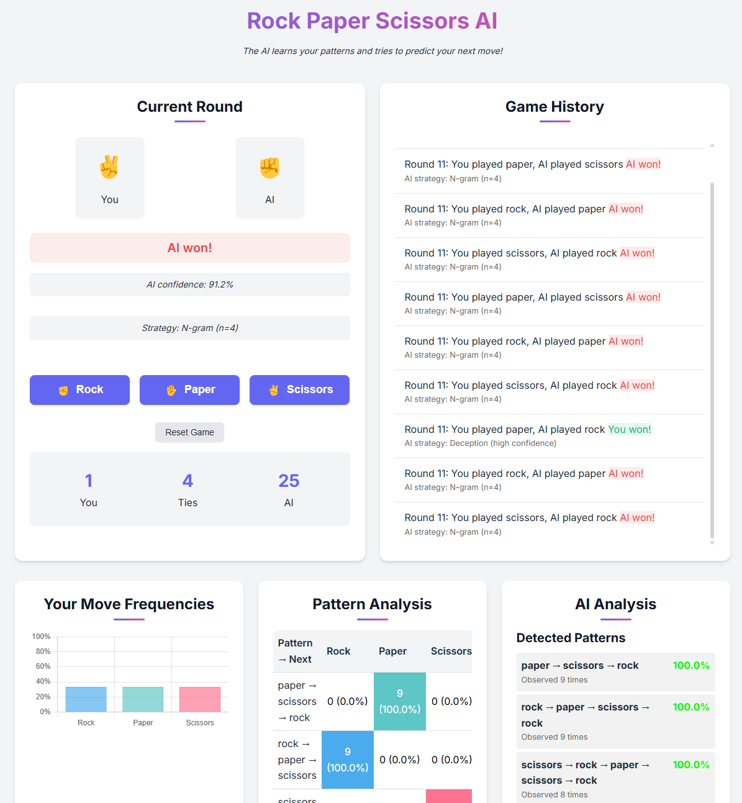

# Rock Paper Scissors AI

A Flask-based web application that lets users play Rock Paper Scissors against an AI that learns and adapts to their
playing patterns in real-time.



## Features

- **Adaptive AI**: The AI creates a unique model for each user, learning their patterns as they play
- **Multi-Strategy Prediction**: Uses N-gram sequence analysis and psychological pattern recognition
- **Real-Time Learning**: AI adapts after each round, getting better at predicting your next move
- **Interactive Visualizations**:
    - Move frequency chart showing your pattern tendencies
    - Transition heatmap revealing your sequential patterns
    - Pattern strength analysis showing which patterns the AI has detected
- **Strategy Transparency**: See which prediction strategy the AI is using against you
- **Session-Based**: Each user gets their own independent model that evolves separately

## Installation

### Requirements

- Python 3.7+
- Flask

### Setup

1. Clone the repository:

```bash
git clone https://github.com/yourusername/rock-paper-scissors-ai.git
cd rock-paper-scissors-ai
```

2. Create a virtual environment:

```bash
python -m venv venv
source venv/bin/activate  # On Windows: venv\Scripts\activate
```

3. Install the required packages:

```bash
pip install flask
```

4. Run the application:

```bash
python app.py
```

5. Open your browser and navigate to `http://127.0.0.1:5000/`

## How It Works

### AI Prediction Model

The core of the application is the `EnhancedPredictor` class which uses multiple strategies to predict player behavior:

1. **Multi-length N-gram Analysis**:
    - Tracks sequences of different lengths (2, 3, and 4 moves)
    - Longer sequences get higher weight when they match
    - Builds transition tables showing the likelihood of each move following each pattern

2. **Frequency Analysis**:
    - Tracks overall move frequencies (rock, paper, scissors)
    - Uses this as a fallback strategy

3. **Result-Based Patterns**:
    - Monitors how players change their moves after wins, losses, or ties
    - Takes advantage of psychological patterns in human play

The AI combines these strategies using a weighted confidence system, prioritizing strategies that have been more
reliable for that particular player.

### Adaptive Difficulty

The system automatically adjusts difficulty:

- For high-confidence predictions (>80%), occasionally makes a deliberately suboptimal move
- For low-confidence predictions (<50%), incorporates more randomness
- Between these thresholds, plays optimally based on the predicted move

## Project Structure

```
rock-paper-scissors/
├── app.py               # Main Flask application with game logic and AI
└── templates/
    └── index.html       # Game UI template
```

## Customization

You can modify the AI behavior by adjusting these parameters in `app.py`:

- Change the `n_values` in the `EnhancedPredictor` initialization to track different sequence lengths
- Adjust the confidence thresholds in `get_counter_move()` to change how the AI responds to predictions
- Modify the weights in the `predict()` method to prioritize different prediction strategies

## Contributing

Contributions are welcome! Please feel free to submit a Pull Request.

## License

This project is licensed under the MIT License - see the LICENSE file for details.

## Acknowledgments

- Flask for the web framework
- Chart.js for data visualization
- D3.js for advanced visualizations
