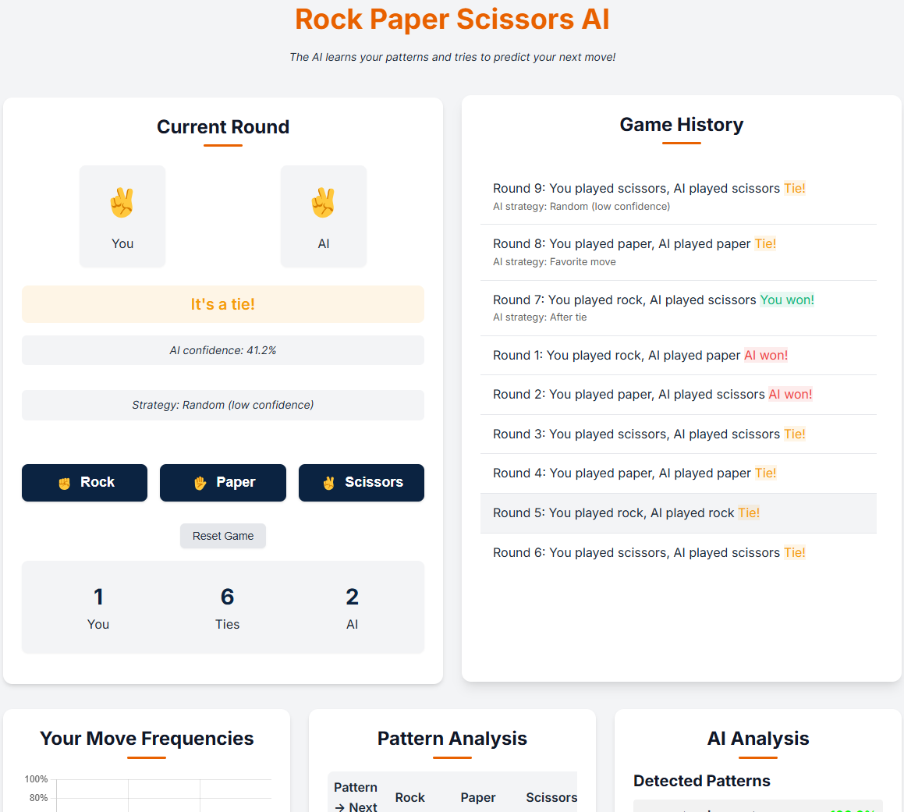

# Rock Paper Scissors

A Flask-based web application that lets users play Rock Paper Scissors against an AI that learns from raw data and adapts to playing patterns in real-time, following principles from "The Bitter Lesson" in machine learning.



## Features

- **Pure Pattern-Learning AI**: The AI creates a model for each player, learning solely from observed patterns without human-engineered heuristics
- **N-gram Pattern Recognition**: Uses variable-length N-gram pattern recognition (up to 7 moves) with automatic weighting
- **Real-Time Adaptation**: AI continuously refines its predictions as more data becomes available
- **Visualization Suite**:
    - Move frequency chart showing distribution of choices
    - Pattern transition heatmap revealing sequential patterns
    - Pattern strength analysis showing detected regularities
    - **NEW: Decision Tree Visualization** showing possible move sequences and probabilities
- **Minimal Human Input**: AI prioritizes learning from data rather than hard-coded strategies
- **Confidence-Based Decisions**: Uses randomness only when pattern confidence is below threshold
- **Session-Based**: Each player gets an independent model that evolves uniquely

## Installation

### Requirements

- Python 3.8+
- uv (fast Python package manager)

### Setup

1. Clone the repository:

```bash
git clone https://github.com/jordanallred/rock-paper-scissors.git
cd rock-paper-scissors
```

2. Install uv (if not already installed):

```bash
curl -LsSf https://astral.sh/uv/install.sh | sh
```

3. Install dependencies and create virtual environment:

```bash
uv sync
```

4. Run the application:

```bash
uv run python app.py
```

5. Open your browser and navigate to `http://127.0.0.1:5001/`

## How It Works

### ML-First Prediction Model

The application uses the `ImprovedMLPredictor` class which follows "The Bitter Lesson" principle of letting machine learning discover patterns with minimal human intervention:

1. **Hierarchical N-gram Analysis**:
    - Tracks sequences of varying lengths (1-7 moves by default)
    - Weights longer patterns more heavily when sufficient data exists
    - Builds transition probability tables automatically

2. **Confidence-Based Decision Making**:
    - Uses randomness only when pattern confidence falls below threshold
    - No human-engineered heuristics or special-case strategies
    - Strictly data-driven prediction based on observed patterns

3. **Automatic Pattern Discovery**:
    - Identifies effective N-gram lengths based on predictive power
    - Calculates pattern entropy and predictability metrics
    - Discovers player tendencies without pre-programmed biases

### Visualizations

The system includes multiple visualizations to help understand the AI's learning process:

- **Move Frequency Chart**: Shows distribution of rock, paper, scissors choices
- **Pattern Transition Heatmap**: Displays how moves follow specific patterns
- **Pattern Strength Analysis**: Lists the strongest patterns the AI has detected
- **Decision Tree Visualization**: Interactive tree showing possible move sequences with probabilities

## Project Structure

```
rock-paper-scissors/
├── app.py               # Main Flask application with ML-first game logic
└── templates/
    └── index.html       # Game UI with interactive visualizations
```

## Customization

You can modify the AI behavior by adjusting these parameters in `app.py`:

- Change the `n_gram_range` in `ImprovedMLPredictor` initialization to track different sequence lengths
- Adjust the `confidence_threshold` to modify when the AI uses pattern recognition vs. randomness
- Modify the ngram weights calculation to prioritize different pattern lengths

## Contributing

Contributions are welcome! Please feel free to submit a Pull Request.

## License

This project is licensed under the MIT License - see the LICENSE file for details.

## Acknowledgments

- Flask for the web framework
- Chart.js for data visualization
- D3.js for advanced visualizations, including the pattern tree